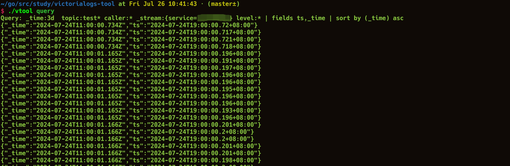

# victorialogs-tool
English | [简体中文](https://github.com/VictoriaMetrics-Community/victorialogs-tool/blob/master/README_CN.md)



A Tool for Querying Victoria-Logs (You'll Love It)

Query based on TOML configuration files and output the result set to the terminal.

## Features

- Simple and easy-to-use command-line interface
- Various combined query methods
- Supports large time range queries (logs from several days, or even more, can be easily retrieved)
- Based on TOML configuration files, allowing multiple configuration files for switching queries, similar to session storage.
- Result set output to the terminal, allowing you to use tools like `grep`, `awk`, `>` and more
- Supports tail query, real-time log viewing (`vtool query -t`)

## Installation

Make sure you have the Go environment installed on your computer.

Option 1:

```bash
go install github.com/VictoriaMetrics-Community/victorialogs-tool@latest && mv $GOPATH/bin/victorialogs-tool $GOPATH/bin/vtool
```

Option 2:

```bash
git clone git@github.com:VictoriaMetrics-Community/victorialogs-tool.git
make build
```

## Usage

```bash
$ ./vtool --help
A wonderful query tool for Victorialogs

Usage:
  vtool [command]

Available Commands:
  completion  Generate the autocompletion script for the specified shell
  currcfg     Get the absolute path of the current configuration file.
  help        Help about any command
  query       query logs from victoriametrics
  setcfg      Set up the configuration file for query logs

Flags:
  -h, --help     help for vtool
  -t, --toggle   Help message for toggle

Use "vtool [command] --help" for more information about a command.
```

1. First, use the vtool setcfg command to set up the configuration file:

```bash
vtool setcfg xxx/i-love-coding.toml
```

This command will generate a `vtool.json` file in the home directory to store the path of the configuration file.

Configuration file reference: https://github.com/VictoriaMetrics-Community/victorialogs-tool/blob/master/cfgs/example.toml

2. Then, run `vtool query`.

*tips: You can use the `vtool currcfg` command to view the absolute path of the current configuration file.*

## Contribution

PRs are welcome.
