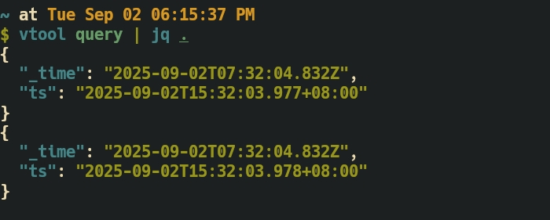

# victorialogs-tool
[English](README.md) | [简体中文](README_CN.md)




A powerful command-line tool for querying VictoriaLogs (you'll love it)

Query VictoriaLogs using TOML configuration files and output results directly to your terminal.

## Features

- Simple and intuitive command-line interface
- Flexible query combinations and filtering options
- Support for large-scale time range queries (handle days of log data with ease)
- TOML-based configuration with multiple config file support (session-like functionality)
- Terminal output that works seamlessly with Unix tools like `grep`, `awk`, and redirection (`>`)
- Real-time log monitoring with tail mode (`vtool query -t`)

## Installation

Ensure you have Go environment installed on your system.

Option 1: Install via go install

```bash
go install github.com/VictoriaMetrics-Community/victorialogs-tool@latest && mv $GOPATH/bin/victorialogs-tool $GOPATH/bin/vtool
```

Option 2: Build from source

```bash
git clone https://github.com/VictoriaMetrics-Community/victorialogs-tool.git
cd victorialogs-tool
make build
```

## Usage

```bash
$ ./vtool --help
A wonderful query tool for Victorialogs

Usage:
  vtool [command]

Available Commands:
  completion  Generate the autocompletion script for the specified shell
  currcfg     Get the absolute path of the current configuration file.
  help        Help about any command
  query       query logs from victoriametrics
  setcfg      Set up the configuration file for query logs

Flags:
  -h, --help     help for vtool
  -t, --toggle   Help message for toggle

Use "vtool [command] --help" for more information about a command.
```

### Quick Start

1. Set up your configuration file using `vtool setcfg`

```bash
vtool setcfg path/to/your/config.toml
```

This command creates a `vtool.json` file in your home directory to store the configuration file path.

2. Run queries with `vtool query`

```bash
vtool query
```

**Tip**: Use `vtool currcfg` to check the absolute path of your current configuration file.

### Configuration File

Reference configuration: https://github.com/VictoriaMetrics-Community/victorialogs-tool/blob/master/cfgs/example.toml

## Contributing

Contributions are welcome! Please feel free to submit pull requests.

## License

This project is licensed under the MIT License.
