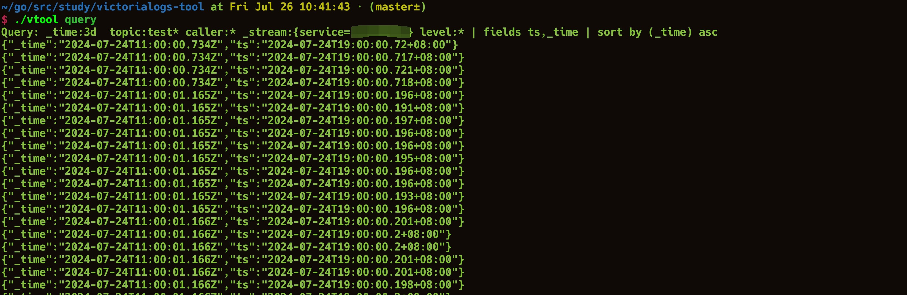

# victorialogs-tool
[English](README.md) | 简体中文




一个强大的 VictoriaLogs 查询命令行工具（你会爱上它）

基于 TOML 配置文件查询 VictoriaLogs，将查询结果直接输出到终端。

## 特性

- 简洁直观的命令行界面
- 灵活的查询组合和过滤选项
- 支持大范围时间查询（轻松处理数天的日志数据）
- 基于 TOML 配置文件，支持多配置文件切换（类似会话功能）
- 终端输出可与 Unix 工具无缝配合使用（如 `grep`、`awk`、重定向 `>` 等）
- 支持 tail 模式实时查看日志（`vtool query -t`）

## 安装

确保你的系统已安装 Go 环境。

选项一：通过 go install 安装

```bash
go install github.com/VictoriaMetrics-Community/victorialogs-tool@latest && mv $GOPATH/bin/victorialogs-tool $GOPATH/bin/vtool
```

选项二：从源码构建

```bash
git clone https://github.com/VictoriaMetrics-Community/victorialogs-tool.git
cd victorialogs-tool
make build
```

## 用法

```bash
$ ./vtool --help
A wonderful query tool for Victorialogs

Usage:
  vtool [command]

Available Commands:
  completion  Generate the autocompletion script for the specified shell
  currcfg     Get the absolute path of the current configuration file.
  help        Help about any command
  query       query logs from victoriametrics
  setcfg      Set up the configuration file for query logs

Flags:
  -h, --help     help for vtool
  -t, --toggle   Help message for toggle

Use "vtool [command] --help" for more information about a command.
```

### 快速开始

1. 使用 `vtool setcfg` 设置配置文件

```bash
vtool setcfg path/to/your/config.toml
```

该命令会在用户主目录下创建 `vtool.json` 文件，用于存储配置文件路径。

2. 运行 `vtool query` 执行查询

```bash
vtool query
```

**提示**：使用 `vtool currcfg` 查看当前配置文件的绝对路径。

### 配置文件

参考配置文件：https://github.com/VictoriaMetrics-Community/victorialogs-tool/blob/master/cfgs/example.toml

## 贡献

欢迎贡献！请随时提交拉取请求。

## 许可证

本项目采用 MIT 许可证。
